# Margin Trading Architecture

Status: proposed architecture based on code inspection of:

- `abb-investment-usm-trade-ms`
- `abb-investment-usm-trade-event-listener-job`

Inspection date: 2026-04-01  
Scope note: this document is grounded only in the code present in the workspace. Where wider platform behavior is required but not visible here, it is marked explicitly as an assumption or dependency.

## 1. Executive Summary

The current codebase is built for spot trading, not leveraged trading. `abb-investment-usm-trade-ms` submits orders directly to DriveWealth after persisting a local `ORDERS_OPERATIONS` row, while `abb-investment-usm-trade-event-listener-job` updates that row from Kafka lifecycle events and runs a few compensating jobs. This architecture is serviceable for spot trading but materially unsafe for margin as-is because it has no explicit loan model, no blocked-collateral model, no strong business-flow correlation between related orders, no durable protective-order retry queue, and only weak event idempotency.

The most important finding is that the current "top-up" mechanism in the inspected workspace is a generic DriveWealth deposit flow used only for commission refunds. It is not a blocked-loan facility. Reusing it to represent borrowed margin principal would be unsafe because the current codebase has no concept of loaned cash that is non-withdrawable and non-reusable, while existing spot validations trust `cashAvailableForTrade` from the external account summary.

The preferred design direction is:

1. Do not model borrowed margin as a normal wallet top-up.
2. Introduce an explicit internal margin domain: `margin_trade`, `margin_loan`, `margin_collateral_block`, durable `order_submission_task`, and an `order_event_inbox`.
3. Keep `ORDERS_OPERATIONS` as the per-order audit row, but extend it with strong correlation fields (`business_flow_id`, `root_order_operation_id`, `parent_order_operation_id`, `order_role`, `submission_state`).
4. Submit both the root margin order and the dependent stop-loss via durable submission tasks using the existing internal order-operation UUID as the broker idempotency key.
5. Let the event listener job continue to own execution/fill event consumption, but do not call the broker inline from Kafka consumers for protective-order creation. Fill events should create or advance durable tasks, not perform fragile inline orchestration.

The main anti-pattern to avoid is "borrow 4000 by top-upping the user's wallet, place the 5000 order, then later try to create a stop-loss." That model creates accounting ambiguity, borrow leakage, and uncovered-risk windows.

## 2. Existing Codebase Analysis

This section contains facts found in code only.

### 2.1 `abb-investment-usm-trade-ms` current architecture

Facts:

- Order APIs are exposed by `TradeController` under `/orders` and bond APIs by `BondController` under `/bonds`.
  - Buy/sell confirm endpoints: `abb-investment-usm-trade-ms/src/main/java/az/abb/investment/usm/trade/controller/TradeController.java:54-99`
  - Cancel endpoint: `abb-investment-usm-trade-ms/src/main/java/az/abb/investment/usm/trade/controller/TradeController.java:101-107`
  - Bond confirm endpoint requires an idempotency header, unlike equity confirm endpoints: `abb-investment-usm-trade-ms/src/main/java/az/abb/investment/usm/trade/controller/BondController.java:45-53`

- `TradeServiceImpl` is the main equity order orchestration service.
  - Buy confirm flow: `abb-investment-usm-trade-ms/src/main/java/az/abb/investment/usm/trade/service/impl/TradeServiceImpl.java:174-209`
  - Sell confirm flow: `abb-investment-usm-trade-ms/src/main/java/az/abb/investment/usm/trade/service/impl/TradeServiceImpl.java:152-171`
  - Local save before broker call: `abb-investment-usm-trade-ms/src/main/java/az/abb/investment/usm/trade/service/impl/TradeServiceImpl.java:444-468`
  - Broker order submission: `abb-investment-usm-trade-ms/src/main/java/az/abb/investment/usm/trade/service/impl/TradeServiceImpl.java:542-565`

- The normal equity trade preview flow reads external account summary, quotes, and instrument details, then computes commission and order availability.
  - Buy preview: `abb-investment-usm-trade-ms/src/main/java/az/abb/investment/usm/trade/service/impl/TradeServiceImpl.java:139-148`, `312-363`
  - Sell preview: `abb-investment-usm-trade-ms/src/main/java/az/abb/investment/usm/trade/service/impl/TradeServiceImpl.java:126-135`, `232-277`

- Current buy eligibility is validated only against external wallet cash from `cashAvailableForTrade`.
  - `validateBuyOrderConfirm`: `abb-investment-usm-trade-ms/src/main/java/az/abb/investment/usm/trade/service/impl/TradeServiceImpl.java:470-484`
  - `CashDto` fields: `abb-investment-usm-trade-ms/src/main/java/az/abb/investment/usm/trade/dto/response/client/account/CashDto.java:13-17`

- Current sell eligibility is validated only against external position quantity from `availableForTradingQty`.
  - `validateSellOrderConfirm`: `abb-investment-usm-trade-ms/src/main/java/az/abb/investment/usm/trade/service/impl/TradeServiceImpl.java:508-521`
  - `EquityPositionDto.availableForTradingQty`: `abb-investment-usm-trade-ms/src/main/java/az/abb/investment/usm/trade/dto/response/client/account/EquityPositionDto.java:25-27`

- Broker order submission is performed through `DriveWealthClient.createOrder`.
  - Interface: `abb-investment-usm-trade-ms/src/main/java/az/abb/investment/usm/trade/client/DriveWealthClient.java:14-28`
  - HTTP implementation: `abb-investment-usm-trade-ms/src/main/java/az/abb/investment/usm/trade/client/impl/DriveWealthClientImpl.java:104-119`

- The DriveWealth idempotency header is set from the local `OrdersOperations.id`.
  - `createOrder(..., idempotencyKey)`: `abb-investment-usm-trade-ms/src/main/java/az/abb/investment/usm/trade/client/impl/DriveWealthClientImpl.java:105-111`
  - `sendDataToDriveWealth` passes `ordersOperations.getId()`: `abb-investment-usm-trade-ms/src/main/java/az/abb/investment/usm/trade/service/impl/TradeServiceImpl.java:542-545`

- Equity confirm endpoints accept the idempotency key header as optional.
  - `TradeController` buy/sell confirm: `abb-investment-usm-trade-ms/src/main/java/az/abb/investment/usm/trade/controller/TradeController.java:61-63`, `91-93`

- If the caller does not provide an idempotency key, a new internal UUID is generated during entity persistence.
  - `TradeServiceImpl.save` only rejects duplicates when the header is non-null: `abb-investment-usm-trade-ms/src/main/java/az/abb/investment/usm/trade/service/impl/TradeServiceImpl.java:448-451`
  - `OrdersOperations.PrePersist` generates a UUID if `id` is null: `abb-investment-usm-trade-ms/src/main/java/az/abb/investment/usm/trade/entity/OrdersOperations.java:91-99`

- The preview DTO generates an idempotency key string, but the confirm API does not enforce that the client uses it.
  - `TradeMapper.buildTradeDto` sets `idempotencyKey(UUID.randomUUID().toString())`: `abb-investment-usm-trade-ms/src/main/java/az/abb/investment/usm/trade/mapper/TradeMapper.java:52-65`
  - Confirm endpoints still treat the header as optional: `TradeController.java:61-63`, `91-93`

- `OrderConfirmRequestDto` contains `orderType`, `price`, `amountCash`, `quantity`, `timeInForce`, `expiration`, and `extendedHours`, but there is no explicit request field for `triggerPrice`.
  - `abb-investment-usm-trade-ms/src/main/java/az/abb/investment/usm/trade/dto/request/client/order/OrderConfirmRequestDto.java:14-30`

- Spot order availability already includes `STOP` and `MARKET_IF_TOUCHED`.
  - `OrderType` enum: `abb-investment-usm-trade-ms/src/main/java/az/abb/investment/usm/trade/enums/OrderType.java:3-8`
  - Allowed order types: `abb-investment-usm-trade-ms/src/main/java/az/abb/investment/usm/trade/utils/impl/OrderAvailabilityUtils.java:22-25`, `35-53`

### 2.2 Current persistence model for orders and order operations

Facts:

- `ORDERS_OPERATIONS` is the main per-order persistence table.
  - Initial DDL: `abb-investment-usm-trade-ms/src/main/resources/db/changelog/v1.0/00002.orders-operations-ddl.yaml:13-63`
  - Entity mapping: `abb-investment-usm-trade-ms/src/main/java/az/abb/investment/usm/trade/entity/OrdersOperations.java:32-119`

- `OrdersOperations.id` is the internal primary key and is a UUID. This is the internal identifier used before the external broker `orderId` exists.
  - Entity ID: `OrdersOperations.java:40-42`

- `OrdersOperations.orderId` and `OrdersOperations.orderNo` are external broker identifiers and are unique once present.
  - Unique constraints: `abb-investment-usm-trade-ms/src/main/resources/db/changelog/v1.1/00014.added-unique-to-orders-operations.yaml:6-15`

- The table stores both:
  - `orderStatus` as a boolean submission-success flag (`SUCCESS` / `FAIL`), and
  - `status` as the lifecycle string (`PENDING`, `PARTIAL_FILL`, `FILLED`, `CANCELED`, `REJECTED`, etc.).
  - Boolean enum: `abb-investment-usm-trade-ms/src/main/java/az/abb/investment/usm/trade/enums/OrderStatus.java:8-12`
  - Lifecycle comments in Liquibase: `abb-investment-usm-trade-ms/src/main/resources/db/changelog/v-DCT-34776/00002.order-operations-adding-remarks.yaml:11-15`

- The field naming is overloaded:
  - `orderType` stores trade side (`BUY` / `SELL`) in the current mapping.
  - `operationType` stores broker order type (`MARKET`, `LIMIT`, `STOP`, etc.).
  - `TradeMapper.toOrdersOperations`: `abb-investment-usm-trade-ms/src/main/java/az/abb/investment/usm/trade/mapper/TradeMapper.java:149-173`

- For equity orders, `orderPrice` is currently populated from `marketValue`, while `operationPrice` stores the user-supplied limit/stop price if present.
  - `TradeMapper.toOrdersOperations`: `TradeMapper.java:163-170`

- `requestId` in `ORDERS_OPERATIONS` stores external broker request IDs and is appended to as a comma-separated string by some update queries.
  - Add column: `abb-investment-usm-trade-ms/src/main/resources/db/changelog/v1.3/00002.added-request-id-column.yaml:6-14`
  - Cancel update appends request IDs: `abb-investment-usm-trade-ms/src/main/java/az/abb/investment/usm/trade/repository/OrdersRepository.java:18-30`

- `ORDERS_OPERATIONS_HISTORY` exists and is a separate table.
  - DDL: `abb-investment-usm-trade-ms/src/main/resources/db/changelog/v-DCT-34776/00001.order-operations-history-ddl.yaml:6-82`
  - It references `ORDERS_OPERATIONS.ORDER_ID`, not the internal UUID.

- `ORDERS_OPERATIONS_HISTORY` has an index on `ORDER_ID`, but there is no visible unique constraint on `REQUEST_ID` in the inspected changelogs.
  - DDL: `00001.order-operations-history-ddl.yaml:62-79`

- In the inspected workspace, `abb-investment-usm-trade-ms` defines the Liquibase changelogs and `abb-investment-usm-trade-event-listener-job` validates the database schema (`ddl-auto: validate`).
  - MS includes Liquibase: `abb-investment-usm-trade-ms/build.gradle:44-45`
  - Listener DB config: `abb-investment-usm-trade-event-listener-job/src/main/resources/application-db.yml:13-17`

- The listener-side `OrdersOperations` entity maps additional fields such as `remainingQuantity`, `expiresAt`, `actualCommission`, `instrumentType`, `accruedInterest`, `ytm`, and `ytw`.
  - Listener entity: `abb-investment-usm-trade-event-listener-job/src/main/java/az/abb/investment/usm/trade/listener/entity/OrdersOperations.java:72-81`

- No matching Liquibase changes for `REMAINING_QUANTITY`, `EXPIRES_AT`, `ACCRUED_INTEREST`, `YTM`, or `YTW` were found in the inspected `abb-investment-usm-trade-ms` changelog tree.
  - Repository-wide search in the inspected workspace found entity usage, but no corresponding Liquibase files for those columns.

### 2.3 Current normal trade lifecycle

Facts:

- Equity confirm flow is:
  1. Read quote and account summary / positions from DriveWealth.
  2. Validate balance or quantity.
  3. Persist `ORDERS_OPERATIONS` with `status=PENDING`, empty broker IDs, and local UUID.
  4. Call DriveWealth `POST /orders`.
  5. On success, update the same row with `orderId`, `orderNo`, `orderStatus=true`, and broker `requestId`.
  6. On some errors, update the row with `orderStatus=false`, `errorMessage`, and `requestId`.
  - Save step: `TradeServiceImpl.java:444-468`
  - Submission step: `TradeServiceImpl.java:542-565`

- Cancel flow:
  1. Find local row by `orderId`.
  2. Verify `accountNo`.
  3. Call broker cancel API.
  4. Call broker order-status API.
  5. If final status is `CANCELED`, update local row with native SQL.
  - `abb-investment-usm-trade-ms/src/main/java/az/abb/investment/usm/trade/service/impl/CancelOrderServiceImpl.java:31-70`

- Spot order detail lookup reads directly from DriveWealth, not from the local order-operation row.
  - `TradeServiceImpl.getOrderDetail`: `abb-investment-usm-trade-ms/src/main/java/az/abb/investment/usm/trade/service/impl/TradeServiceImpl.java:217-228`

- The bond flow uses a similar pattern but with a dedicated `BondOrderServiceImpl` save transaction and a later broker call.
  - Save transaction: `abb-investment-usm-trade-ms/src/main/java/az/abb/investment/usm/trade/service/impl/BondOrderServiceImpl.java:27-37`
  - Broker call: `abb-investment-usm-trade-ms/src/main/java/az/abb/investment/usm/trade/service/impl/BondServiceImpl.java:196-227`

### 2.4 `abb-investment-usm-trade-event-listener-job` current architecture

Facts:

- Kafka listeners are defined for:
  - `orders-created`
  - `orders-updated`
  - `orders-completed`
  - `users-updated`
  - `transactions-created`
  - `positions-updated`
  - `deposits-updated`
  - Topic config: `abb-investment-usm-trade-event-listener-job/src/main/resources/application-kafka.yml:16-35`

- Core order lifecycle consumers:
  - `OrderCreatedConsumer`: `abb-investment-usm-trade-event-listener-job/src/main/java/az/abb/investment/usm/trade/listener/service/consumers/OrderCreatedConsumer.java:37-170`
  - `OrderUpdatedConsumer`: `abb-investment-usm-trade-event-listener-job/src/main/java/az/abb/investment/usm/trade/listener/service/consumers/OrderUpdatedConsumer.java:30-113`
  - `OrderCompletedConsumer`: `abb-investment-usm-trade-event-listener-job/src/main/java/az/abb/investment/usm/trade/listener/service/consumers/OrderCompletedConsumer.java:35-109`

- These order lifecycle consumers are marked `@Transactional`.
  - Created: `OrderCreatedConsumer.java:53-55`
  - Updated: `OrderUpdatedConsumer.java:44-46`
  - Completed: `OrderCompletedConsumer.java:57-59`

- Order rows are looked up by external `orderId` with a pessimistic write lock.
  - `findByOrderId`: `abb-investment-usm-trade-event-listener-job/src/main/java/az/abb/investment/usm/trade/listener/repository/OrdersRepository.java:26-27`

- `OrderCreatedConsumer` will create an `ORDERS_OPERATIONS` row from the event if it cannot find one locally by `payload.id`.
  - Missing row branch: `OrderCreatedConsumer.java:71-79`
  - Row reconstruction from event payload plus quote/instrument lookup: `OrderCreatedConsumer.java:95-135`

- `OrderUpdatedConsumer` throws `KafkaException` when it cannot find the order row by `payload.id`.
  - `OrderUpdatedConsumer.java:49-53`

- `OrderCompletedConsumer` also throws `KafkaException` when it cannot find the order row by `payload.id`.
  - `OrderCompletedConsumer.java:60-65`

- The listener job has a scheduled "lost orders" reconciliation process that polls DriveWealth for some stale `PENDING` orders.
  - Scheduler definitions: `abb-investment-usm-trade-event-listener-job/src/main/resources/application-scheduler.yml:1-6`
  - Service: `abb-investment-usm-trade-event-listener-job/src/main/java/az/abb/investment/usm/trade/listener/service/impl/LostOrdersServiceImpl.java:37-97`

- The lost-order queries only consider rows where:
  - `STATUS = 'PENDING'`
  - `ERROR_MESSAGE is null`
  - `ORDER_ID is not null`
  - plus age/type conditions.
  - Market query: `abb-investment-usm-trade-event-listener-job/src/main/java/az/abb/investment/usm/trade/listener/repository/OrdersRepository.java:35-41`
  - Non-market query: `abb-investment-usm-trade-event-listener-job/src/main/java/az/abb/investment/usm/trade/listener/repository/OrdersRepository.java:43-49`

- `OrderOperationsServiceImpl` is the main completed-event updater. It rewrites lifecycle fields, fees, commission, transaction charge, and status.
  - `abb-investment-usm-trade-event-listener-job/src/main/java/az/abb/investment/usm/trade/listener/service/impl/OrderOperationsServiceImpl.java:37-113`

- `OrderUpdatedConsumer` has a special rule:
  - if the current local status is already one of `FILLED`, `CANCELED`, `REJECTED`, or `PARTIAL_FILL_CANCELLED`, it skips the normal update and only adjusts `remainingQuantity` if that field is already non-null.
  - `OrderUpdatedConsumer.java:62-73`
  - Status helper: `abb-investment-usm-trade-event-listener-job/src/main/java/az/abb/investment/usm/trade/listener/enums/OrderStatusTypeStrings.java:20-34`

- `remainingQuantity` is not initialized by the main order update path. It is only adjusted if already non-null.
  - Updated consumer: `OrderUpdatedConsumer.java:106-112`
  - Completed consumer service: `OrderOperationsServiceImpl.java:97-101`

- The monthly realized P/L job lazily initializes `remainingQuantity` from `executedQuantity` for BUY orders when it is null.
  - `abb-investment-usm-trade-event-listener-job/src/main/java/az/abb/investment/usm/trade/listener/job/RealizePlJob.java:219-277`

- `ORDERS_OPERATIONS_HISTORY` is currently used by the order consumers as a duplicate-event guard keyed by `requestId = event.id`.
  - Repository method: `abb-investment-usm-trade-event-listener-job/src/main/java/az/abb/investment/usm/trade/listener/repository/OrdersOperationsHistoryRepository.java:11-13`
  - Updated consumer guard: `OrderUpdatedConsumer.java:54-59`
  - Completed consumer guard: `OrderCompletedConsumer.java:75-78`
  - Created consumer saves history only after processing logic: `OrderCreatedConsumer.java:61-67`

- `OrdersOperationHistoryImpl` writes `requestId = event.id`.
  - Updated event history write: `abb-investment-usm-trade-event-listener-job/src/main/java/az/abb/investment/usm/trade/listener/service/impl/OrdersOperationHistoryImpl.java:62-78`
  - Completed event history write: `OrdersOperationHistoryImpl.java:80-105`
  - Created event history write: `OrdersOperationHistoryImpl.java:107-113`

### 2.5 Current retry, idempotency, and reconciliation posture

Facts:

- API-side idempotency exists only if the caller supplies the optional `DW_IDEMPOTENCY_KEY_HEADER` on equity order confirm endpoints.
  - `TradeController.java:61-63`, `91-93`
  - Duplicate check: `TradeServiceImpl.java:448-451`

- Order lifecycle Kafka consumers use `@RetryableTopic`, typically with 10 attempts and exponential backoff.
  - Created: `OrderCreatedConsumer.java:48-53`
  - Updated: `OrderUpdatedConsumer.java:39-45`
  - Completed: `OrderCompletedConsumer.java:51-58`

- There is no dedicated inbox table, outbox table, or durable retry-task table in the inspected workspace.
  - Repository-wide searches found no outbox/inbox/task abstractions for order orchestration.

- There is no `@DltHandler` or explicit dead-letter processing code in the inspected workspace.
  - Repository-wide search found no DLT handlers.

- Some critical order-processing methods swallow exceptions instead of rethrowing them:
  - `OrderCreatedConsumer.trySaveOperation`: `OrderCreatedConsumer.java:82-93`
  - `OrderUpdatedConsumer.updateOrders`: `OrderUpdatedConsumer.java:62-78`
  - `OrderOperationsServiceImpl.updateOrders`: `OrderOperationsServiceImpl.java:37-47`
  - `OrdersOperationHistoryImpl.trySave...`: `OrdersOperationHistoryImpl.java:30-59`

- The "lost orders" reconciliation only repairs some stale pending orders and only when local `ORDER_ID` is already populated.
  - Query filters: `OrdersRepository.java:35-49`
  - Polling service: `LostOrdersServiceImpl.java:37-97`

### 2.6 Current top-up, accounting, and blocking model

Facts:

- No general customer top-up API/controller was found in either inspected module.

- The only funding/top-up flow found in the workspace is a generic DriveWealth deposit call used for commission refunds.
  - Back-office client method: `abb-investment-usm-trade-event-listener-job/src/main/java/az/abb/investment/usm/trade/listener/client/DriveWealthClient.java:33-36`
  - Service wrapper: `abb-investment-usm-trade-event-listener-job/src/main/java/az/abb/investment/usm/trade/listener/service/impl/DrwDepositServiceImpl.java:26-37`
  - Request body fields are only `accountNo`, `amount`, `currency`, `type`, and `note`: `abb-investment-usm-trade-event-listener-job/src/main/java/az/abb/investment/usm/trade/listener/dto/request/client/deposit/DriveWealthTopupRequestDto.java:14-19`
  - The mapper hard-codes `type=INSTANT_FUNDING` and a commission-refund note: `abb-investment-usm-trade-event-listener-job/src/main/java/az/abb/investment/usm/trade/listener/mapper/DrwMapper.java:15-24`

- That deposit flow is triggered only by the commission refund service.
  - Refund logic: `abb-investment-usm-trade-event-listener-job/src/main/java/az/abb/investment/usm/trade/listener/service/impl/commission/CommissionServiceImpl.java:37-97`
  - Deposit-updated consumer only reacts to deposit notes starting with `"Comission"`: `abb-investment-usm-trade-event-listener-job/src/main/java/az/abb/investment/usm/trade/listener/service/consumers/DepositUpdatedConsumer.java:50-86`

- The current spot order validator uses external `cashAvailableForTrade` directly and does not subtract any internal blocked/reserved amount.
  - `TradeServiceImpl.validateBuyOrderConfirm`: `TradeServiceImpl.java:470-484`

- The current codebase contains no internal model named or behaving like:
  - margin loan
  - collateral block
  - buying power
  - reserved cash ledger
  - blocked borrowed funds
  - margin business flow
  - Repository-wide search in the inspected modules found no such domain abstractions.

### 2.7 Current correlation, parent-child, and business-flow metadata

Facts:

- No existing parent/child order relationship fields or business-flow correlation fields were found in the inspected codebase for `ORDERS_OPERATIONS`.

- `ORDERS_OPERATIONS` currently cannot answer, from schema alone:
  - which stop-loss belongs to which root order,
  - which orders belong to one leveraged business flow,
  - whether a filled position is currently protected,
  - whether a retry is pending,
  - whether an order is a system-generated protective order.

### 2.8 Existing transaction boundaries and observability

Facts:

- `TradeServiceImpl` is not annotated `@Transactional`.

- `BondOrderServiceImpl.saveOrder` is transactional, but broker order submission still happens after the local save returns.
  - `BondOrderServiceImpl.java:27-37`
  - `BondServiceImpl.java:123-140`, `196-227`

- `CancelOrderServiceImpl` uses `TransactionTemplate` only around the local status update after the external cancel/check.
  - `CancelOrderServiceImpl.java:55-69`

- Listener order consumers are transactional, but asynchronous cache/summary deletion and notifications happen outside the core DB transaction.
  - `OrderCompletedConsumer.java:80-84`
  - `OrderOperationsServiceImpl.java:50-74`

- Both services include Spring Boot Actuator, but management web exposure is limited to `info, health`.
  - MS: `abb-investment-usm-trade-ms/src/main/resources/application-management.yml:19-22`
  - Listener: `abb-investment-usm-trade-event-listener-job/src/main/resources/application-management.yml:19-22`

## 3. Margin Trading Problem Statement

### 3.1 The actual problem

Recommendation:

Margin trading here is not "spot trading plus an automatic stop-loss." The system must manage one coherent financial business flow with at least five linked state domains:

1. Customer-owned cash.
2. Borrowed principal provided by the institution.
3. A root exposure-creating order.
4. A dependent protective stop-loss order.
5. Ongoing recoverability and audit state across process restarts, retries, duplicate events, and unknown broker outcomes.

The business example:

- Customer owns 1000.
- Institution provides 4000.
- Total exposure is 5000.
- Root order is placed for 5000 exposure.
- After fills occur, a protective stop-loss must exist and must be traceable to the same margin business flow.

### 3.2 Why this is not a small extension of spot trading

Recommendation:

Spot trading in the current codebase is mostly "validate external cash/quantity, persist one order row, submit to broker, then react to broker events." Margin trading adds:

- institution credit risk,
- blocked collateral semantics,
- non-withdrawable loan semantics,
- open-position protection requirements,
- cross-order dependencies,
- recovery obligations when the dependent order is missing,
- and stronger operational obligations when unknown outcomes occur.

In spot trading, a missing dependent order is usually a UX defect.  
In margin trading, a filled position without its protective order is an uncovered institutional risk position.

### 3.3 Why naive "top-up borrowed cash and place stop later" is dangerous

Recommendation:

Using the currently inspected deposit/top-up mechanism to inject borrowed cash into the user's normal account is dangerous because:

1. The current deposit API is generic. The request body only carries `accountNo`, `amount`, `currency`, `type`, and `note`. There is no blocked, non-withdrawable, loan, or reserved semantic in that API shape.
2. Current spot buy validation trusts external `cashAvailableForTrade`. If borrowed cash is injected into the same wallet-like balance, the customer can likely reuse it for unrelated orders unless every order eligibility path is rewritten.
3. Current DTOs also expose `cashAvailableForWithdrawal`. If the broader platform trusts the broker account summary for withdrawals, a generic top-up risks making borrowed principal appear withdrawable unless other services outside this repo block it.
4. Placing the stop-loss only after the fill means the system must safely bridge a real uncovered-risk window. The current codebase has no durable protective-order task queue for that.

## 4. Gap Analysis

### 4.1 What exists and can be reused safely

Recommendation:

- Reuse `ORDERS_OPERATIONS` as the per-order audit record, but extend it. Do not replace it.
- Reuse the existing DriveWealth order-submission client in `abb-investment-usm-trade-ms`.
- Reuse the listener job's Kafka lifecycle consumption and row update patterns as a base for root/protective order status updates.
- Reuse the listener's `findByOrderId` pessimistic lock pattern for event-driven row mutation.
- Reuse the existing internal UUID-as-broker-idempotency-key pattern, but make it mandatory and task-driven for margin.

### 4.2 What exists but is unsafe or insufficient

Recommendation:

- The current optional equity idempotency header is insufficient. Margin must treat idempotency as mandatory, not optional.
- The current synchronous spot submission pattern is too weak for margin because local persistence and external submission are not bound by a durable orchestration model.
- `ORDERS_OPERATIONS_HISTORY` should not be reused as the idempotency inbox for margin event processing. It is an audit table, not a strict dedupe barrier.
- The current lost-orders cron is not sufficient for margin. It only reconciles some stale pending orders with existing `ORDER_ID`s and final statuses.
- The current generic deposit/refund flow must not be reused for borrowed margin principal.

### 4.3 What is missing entirely

Recommendation:

The current workspace is missing:

- a `margin_trade` business-flow aggregate,
- a `margin_loan` model,
- an explicit blocked-collateral model,
- a durable broker order-submission task queue,
- a durable order-event inbox with unique event IDs,
- a protective-order state machine,
- an uncovered-position watchdog,
- strong root/child order correlation,
- and a manual-review escalation path for unrecoverable inconsistencies.

### 4.4 Which abstractions should not be reused as-is

Recommendation:

Do not reuse these as-is for margin:

- `TradeServiceImpl.validateBuyOrderConfirm` cash check.
- `DrwDepositService.makeDeposit`.
- `ORDERS_OPERATIONS_HISTORY.findByRequestId(...)` as the main idempotency mechanism.
- The existing synchronous equity `buyOrderAndConfirm` / `sellOrderAndConfirm` endpoint shape for margin root order orchestration.

## 5. Domain Model Recommendation

### 5.1 Recommended target domain language

Recommendation:

Use the following domain terms explicitly and consistently:

- **Margin Trade**: one leveraged entry flow for one instrument and one tranche of institution financing. It is the business aggregate and correlation root.
- **Root Order**: the broker order that opens the leveraged exposure.
- **Dependent Protective Order**: a broker order created only because the root margin trade exists.
- **Stop-Loss Order**: the first mandatory dependent protective order for v1.
- **Margin Loan**: the institution-provided principal reserved and then drawn when the root order fills.
- **Blocked Collateral**: customer-owned cash locked against the loan and not withdrawable or reusable.
- **Available Cash**: customer-owned free cash after subtracting internal blocks.
- **Borrowed Amount**: institution principal outstanding; never customer cash.
- **Buying Power**: internal eligibility value for margin entry; not wallet cash.
- **Margin Position**: the open leveraged exposure of one margin trade.
- **Margin Business Flow**: the linked aggregate of margin trade, loan, collateral, root order, protective order, tasks, and events.
- **Retryable Failure**: a recoverable orchestration failure where retry is safe because a deterministic idempotency key already exists.
- **Uncovered Filled Margin Position**: filled quantity is open but no confirmed protective order covers it.
- **Reconciliation Item**: a persisted investigation record for unknown broker submission outcome or drift between broker and local state.

### 5.2 Relationship model

Recommendation:

For v1, model one `margin_trade` as one financing tranche:

- `margin_trade`
  - has one root order operation
  - has zero or one current active stop-loss order operation
  - has one margin loan
  - has one collateral block
  - may have multiple submission tasks and reconciliation attempts over its lifetime

Relationship between money and orders:

- Customer cash is not spent directly as "free wallet cash" once allocated to margin.
- Customer cash becomes blocked collateral.
- Borrowed funds become loan principal, not wallet cash.
- Root order fill events draw the loan and open the exposure.
- Protective-order tasks consume the filled quantity and stop price policy to create the dependent stop-loss.
- Protective-order activation changes the margin trade from `UNPROTECTED` to `PROTECTED`.

### 5.3 Real-time protection model

Recommendation:

Protection should be attached to filled exposure, not to order intent.

That means:

- if filled quantity is zero, no protective stop is needed yet;
- if filled quantity is positive and active protected quantity is lower than filled quantity, the trade is uncovered;
- the system must store `filled_quantity`, `protected_quantity`, and `uncovered_since` on the margin trade aggregate.

This is required because the current `remainingQuantity` field in `ORDERS_OPERATIONS` is not maintained in real time and is only initialized later by the realized P/L job.

## 6. Accounting / Balance / Blocking Model

This is the most important section.

### 6.1 Evaluate the three candidate models

#### Option A: physically top-up borrowed amount into the normal wallet

Recommendation: reject.

Why:

- The only top-up/deposit flow found in this workspace is the generic DriveWealth deposit endpoint used for commission refunds.
- It has no blocked-loan or restricted-funds semantics.
- Existing spot order validation trusts `cashAvailableForTrade`.
- Existing cash DTO also contains `cashAvailableForWithdrawal`.
- Therefore this option is unsafe unless a wider platform outside this repo already enforces non-withdrawable, non-reusable restrictions across all order and withdrawal paths. No such enforcement is visible here.

#### Option B: represent borrowed amount as internal loaned buying power only

Recommendation: preferred if the broker can accept the trade without a generic wallet cash top-up.

Why:

- It preserves clean accounting semantics.
- Borrowed principal never becomes customer cash.
- Customer collateral can be blocked independently.
- Order eligibility can be computed from internal risk rules instead of wallet mutation.

#### Option C: hybrid model with internal loan ledger plus external restricted funding rail

Recommendation: acceptable only if the external broker offers a distinct non-withdrawable restricted-credit or segregated-funding facility.

Why:

- Some brokers will not accept orders larger than cash unless the broker account itself has margin/buying-power support.
- If such broker support exists, an internal loan/blocking model is still mandatory, but the external funding rail must also be explicitly restricted.
- The current inspected generic deposit endpoint is not such a facility.

### 6.2 Final recommendation

Recommendation:

Implement margin using an explicit internal accounting model:

1. `margin_loan` for institution principal.
2. `margin_collateral_block` for customer-owned blocked cash.
3. `margin_trade` for business-flow state and protection state.
4. Margin order eligibility based on internal available cash plus approved loan buying power.

Do not treat borrowed principal as normal free wallet cash.

### 6.3 Exact recommended balance semantics

Recommendation:

#### Customer own cash

- Source: external account summary plus local blocked-collateral deductions.
- Definition:
  - `external_cash_available_for_trade` comes from DriveWealth.
  - `internal_blocked_collateral_total` is the sum of active margin collateral blocks in local DB.
  - `available_own_cash_for_new_orders = external_cash_available_for_trade - internal_blocked_collateral_total - other_local_holds`

Important implementation note:

- Because current spot order validation uses only `cashAvailableForTrade`, all buy-order eligibility in `trade-ms`, not only margin APIs, must be updated to subtract local margin blocks. Otherwise customer cash blocked for margin can still be reused by normal spot orders.

#### Borrowed amount

- Source: `margin_loan`.
- States:
  - reserved before fill,
  - drawn on fill,
  - outstanding while position remains open,
  - repaid on close,
  - released if never drawn.
- It never appears in customer withdrawable cash.

#### Blocked collateral

- Source: `margin_collateral_block`.
- Behavior:
  - reserved when the margin trade is accepted,
  - converted to active collateral as fills occur,
  - reduced and released as the loan is repaid,
  - not reusable for unrelated spot or margin orders,
  - not withdrawable.

#### Available balance

- For margin trading, use `available_own_cash_for_new_orders` plus policy-approved undrawn loan capacity.
- For normal spot trading, `trade-ms` must be extended so the current validator also subtracts margin collateral blocks.

#### Withdrawable balance

- Must equal external withdrawable cash minus active collateral blocks.
- The withdrawal enforcement code is not present in this workspace, so wider platform integration is required before go-live.

### 6.4 Order placement eligibility

Recommendation:

Margin eligibility should be checked by a dedicated service, not by `TradeServiceImpl.validateBuyOrderConfirm`.

Required checks:

1. External account is in an approved margin-capable state.
2. Customer available own cash is sufficient for required collateral and fees.
3. Margin loan approval and product/risk limits allow the requested borrowing.
4. Instrument risk policy allows leveraged exposure.
5. Trading session policy for margin allows the order type and market state.

### 6.5 Partial fill behavior

Recommendation:

This is a key product-policy choice.

Safest v1 policy:

- Allow only long BUY margin entries submitted as `MARKET` orders in core market session.
- Reason: long-lived partial fills require stop-loss quantity creation/replacement logic on every fill progression. The current codebase does not have a safe replace-or-adjust mechanism for dependent protective orders.

If business insists on limit entry orders in v1, then:

- protection must be created on first fill, not only after final fill;
- protected quantity must be adjusted whenever cumulative filled quantity increases;
- each adjustment needs durable idempotency, reconciliation, and anti-duplicate logic.

### 6.6 Interest and fee accrual basis

Recommendation:

- Loan interest accrues from actual draw time, not from order submission or collateral reservation.
- Draw time equals the execution timestamp of the root fill event that increases financed exposure.
- For v1, one `margin_loan` row per `margin_trade` can store:
  - `reserved_principal`
  - `drawn_principal`
  - `outstanding_principal`
  - `accrual_start_at`
  - `last_accrued_at`
  - pricing/rate code

Future enhancement:

- if fills occur over materially different times and exact interest-by-fill is needed, add a `margin_loan_draw_history` table in phase 2 or 3.

### 6.7 Release and unblock rules

Recommendation:

- **Root order rejected, zero fill**:
  - release full collateral reservation
  - release full undrawn loan reservation
- **Root order canceled, zero fill**:
  - same as reject
- **Root order partially filled, then canceled**:
  - keep collateral and loan only for the filled financed exposure
  - release reservation for the unfilled remainder
- **Root order fully filled**:
  - convert reservation into active outstanding loan/collateral
- **Position partially closed later**:
  - repay loan principal according to tranche logic
  - release proportional collateral
- **Position fully closed**:
  - loan outstanding becomes zero
  - release remaining collateral

## 7. Order Relationship / Correlation Design

### 7.1 Recommended minimal but strong field set

Recommendation:

Extend `ORDERS_OPERATIONS` with these fields:

| Field | Why it exists | Who writes it | Who reads it |
| --- | --- | --- | --- |
| `business_flow_id` | Canonical correlation key for one margin trade flow | margin API, protective-order creator | listener, workers, ops, reconciliation |
| `business_flow_type` | Disambiguates future reuse of `business_flow_id` | same writer as above | generic reporting and tooling |
| `root_order_operation_id` | Stable pointer to the root internal order row even before external `orderId` exists | root creator sets self; child creator copies root | query model, listener, ops |
| `parent_order_operation_id` | Immediate dependency link for child orders | child creator | retry logic, audit, UI/debug |
| `order_role` | Distinguishes root entry vs protective stop vs future types | order creator | all order-flow consumers |
| `submission_state` | Separates broker-submission lifecycle from trade lifecycle | submission worker | API, recovery jobs, ops |

### 7.2 Fields to avoid

Recommendation:

Do not add all of these unless a later use case proves them necessary:

- `correlationId`
- `marginTradeId` as a separate column if it would always equal `business_flow_id`
- `linkedOrderId`
- `relatedOrderType`
- `protectiveOrderType` as a separate field if `order_role` already identifies stop-loss

Reason:

- these fields overlap and create ambiguous ownership.
- margin safety improves when there is exactly one canonical business-flow ID.

### 7.3 Canonical IDs

Recommendation:

- Use `margin_trade.id` as the business-flow root ID.
- Store that same UUID in `orders_operations.business_flow_id`.
- Use internal `orders_operations.id` for root/parent linkage, not external `orderId`.

Do not use broker `orderId` as the root correlation key because:

- it does not exist before submission,
- it may be unknown during timeout/unknown-result scenarios,
- and current code already shows that local rows exist before broker IDs are available.

### 7.4 Where retry and event-processing metadata should live

Recommendation:

- Retry metadata belongs in `ORDER_SUBMISSION_TASK`, not in `ORDERS_OPERATIONS`.
- Event dedupe metadata belongs in `ORDER_EVENT_INBOX`, not in `ORDERS_OPERATIONS_HISTORY`.
- High-level protection state belongs in `MARGIN_TRADE`.

## 8. Data Model / Schema Proposal

### 8.1 Summary recommendation

Recommendation:

- Extend `ORDERS_OPERATIONS`.
- Create `MARGIN_TRADE`.
- Create `MARGIN_LOAN`.
- Create `MARGIN_COLLATERAL_BLOCK`.
- Create `ORDER_SUBMISSION_TASK`.
- Create `ORDER_EVENT_INBOX`.
- Do **not** create `MARGIN_ORDER_LINK` in v1.
- Do **not** use `ORDERS_OPERATIONS` alone as the retry queue.
- Do **not** use a separate reconciliation table in phase 1 if `ORDER_SUBMISSION_TASK` already stores unknown-result and retry metadata; add a dedicated reconciliation-attempt table in phase 2 if needed.

### 8.2 Standard columns for every new table

Recommendation:

Every new table should include at least:

- `id`
- `created_at`
- `updated_at`
- `version`
- `created_by_service`
- `updated_by_service`

Purpose:

- restart-safe optimistic concurrency,
- audit of which module mutated the row,
- deterministic operational forensics.

### 8.3 Extend `ORDERS_OPERATIONS`

Recommendation:

Pseudo-DDL:

```sql
ALTER TABLE ORDERS_OPERATIONS ADD (
    BUSINESS_FLOW_ID RAW(16),
    BUSINESS_FLOW_TYPE VARCHAR2(30),
    ROOT_ORDER_OPERATION_ID RAW(16),
    PARENT_ORDER_OPERATION_ID RAW(16),
    ORDER_ROLE VARCHAR2(40),
    SUBMISSION_STATE VARCHAR2(30)
);

CREATE INDEX IDX_ORD_OP_FLOW_ID ON ORDERS_OPERATIONS (BUSINESS_FLOW_ID);
CREATE INDEX IDX_ORD_OP_ROOT_ID ON ORDERS_OPERATIONS (ROOT_ORDER_OPERATION_ID);
CREATE INDEX IDX_ORD_OP_PARENT_ID ON ORDERS_OPERATIONS (PARENT_ORDER_OPERATION_ID);
```

Field details:

| Field | Purpose | Writer ownership | Read paths | Lifecycle | Audit importance | Required |
| --- | --- | --- | --- | --- | --- | --- |
| `BUSINESS_FLOW_ID` | Links every related order to one margin trade flow | margin API or protective-order creator | order queries, listener, workers, ops | set at row creation, immutable | very high | required for margin rows |
| `BUSINESS_FLOW_TYPE` | Distinguishes `MARGIN_TRADE` from future flows | same as above | reporting, generic worker filters | immutable | medium | recommended |
| `ROOT_ORDER_OPERATION_ID` | Stable root link for child orders | root row sets self; child rows inherit | protection lookup, audit, reconciliation | immutable | very high | required for margin rows |
| `PARENT_ORDER_OPERATION_ID` | Direct dependency pointer | child order creator | retry and dependency logic | immutable | high | required for dependent orders |
| `ORDER_ROLE` | Identifies root vs protective order | order creator | query layer, listener hooks, ops | immutable | very high | required for margin rows |
| `SUBMISSION_STATE` | Tracks broker-submission orchestration state separately from fill status | submission worker | API/status, recovery jobs, ops | mutates until submission resolves | very high | required for all margin-submitted rows |

Notes:

- Keep existing `status` as broker lifecycle status.
- Keep existing `orderStatus` for backward compatibility only.
- New margin logic should rely on `SUBMISSION_STATE`, not on `orderStatus`.

### 8.4 `MARGIN_TRADE`

Recommendation:

Pseudo-DDL:

```sql
CREATE TABLE MARGIN_TRADE (
    ID RAW(16) PRIMARY KEY,
    ACCOUNT_NO VARCHAR2(255) NOT NULL,
    ACCOUNT_ID VARCHAR2(255),
    INVESTOR_ID VARCHAR2(255),
    INSTRUMENT_ID VARCHAR2(255) NOT NULL,
    SYMBOL VARCHAR2(50) NOT NULL,
    POSITION_DIRECTION VARCHAR2(20) NOT NULL,
    ROOT_ORDER_OPERATION_ID RAW(16) NOT NULL,
    CURRENT_STOP_ORDER_OPERATION_ID RAW(16),
    REQUESTED_EXPOSURE_AMOUNT NUMBER(22,8) NOT NULL,
    REQUESTED_QUANTITY NUMBER(22,8),
    CUSTOMER_CASH_TARGET NUMBER(22,8) NOT NULL,
    BORROWED_AMOUNT_TARGET NUMBER(22,8) NOT NULL,
    FILLED_QUANTITY NUMBER(22,8) DEFAULT 0 NOT NULL,
    FILLED_EXPOSURE_AMOUNT NUMBER(22,8) DEFAULT 0 NOT NULL,
    PROTECTED_QUANTITY NUMBER(22,8) DEFAULT 0 NOT NULL,
    STOP_PRICE NUMBER(22,8),
    STATE VARCHAR2(30) NOT NULL,
    PROTECTION_STATE VARCHAR2(30) NOT NULL,
    UNCOVERED_SINCE TIMESTAMP(6),
    LAST_ERROR_CODE VARCHAR2(100),
    LAST_ERROR_MESSAGE VARCHAR2(2000),
    MANUAL_REVIEW_REQUIRED NUMBER(1) DEFAULT 0 NOT NULL,
    VERSION NUMBER(10) DEFAULT 0 NOT NULL,
    CREATED_AT TIMESTAMP(6) NOT NULL,
    UPDATED_AT TIMESTAMP(6) NOT NULL,
    CREATED_BY_SERVICE VARCHAR2(100),
    UPDATED_BY_SERVICE VARCHAR2(100)
);
```

Field details:

| Field | Purpose | Writer ownership | Read paths | Lifecycle | Audit importance | Required |
| --- | --- | --- | --- | --- | --- | --- |
| `ID` | Business-flow root ID | margin API | everything | immutable | very high | required |
| `ACCOUNT_NO`, `ACCOUNT_ID`, `INVESTOR_ID` | Identifies customer account context | margin API | API, listener, ops | immutable | high | accountNo required |
| `INSTRUMENT_ID`, `SYMBOL` | Instrument context | margin API | API, listener, workers | immutable | high | required |
| `POSITION_DIRECTION` | v1 should be `LONG` only | margin API | risk logic | immutable | medium | required |
| `ROOT_ORDER_OPERATION_ID` | Internal root order link | margin API | listener, workers, queries | immutable | very high | required |
| `CURRENT_STOP_ORDER_OPERATION_ID` | Current active protective order | protection creator / reconciliation | API, ops, risk monitors | mutable | very high | nullable until stop exists |
| `REQUESTED_EXPOSURE_AMOUNT`, `REQUESTED_QUANTITY` | User intent | margin API | API, audit | immutable | high | exposure required |
| `CUSTOMER_CASH_TARGET` | Required own-funds contribution | margin API | eligibility, accounting | immutable | very high | required |
| `BORROWED_AMOUNT_TARGET` | Intended borrowed principal | margin API | loan logic, risk | immutable | very high | required |
| `FILLED_QUANTITY`, `FILLED_EXPOSURE_AMOUNT` | Current realized exposure | listener from fill events | API, risk, protection worker | mutable | very high | required |
| `PROTECTED_QUANTITY` | Filled quantity currently protected by active stop | listener / reconciliation | risk, watchdogs | mutable | very high | required |
| `STOP_PRICE` | Current policy stop price | margin API / risk engine | protection worker, reconciliation | mutable only by policy change | high | required for stop-based flow |
| `STATE` | Business-flow state machine | API, listener, close logic | API, ops | mutable | very high | required |
| `PROTECTION_STATE` | Protection-specific state machine | listener, worker | risk monitoring | mutable | very high | required |
| `UNCOVERED_SINCE` | Timestamp for uncovered-risk SLA | listener | alerts, auto-close logic | mutable | very high | nullable |
| `LAST_ERROR_CODE`, `LAST_ERROR_MESSAGE` | Latest actionable failure context | worker/listener | ops | mutable | high | optional |
| `MANUAL_REVIEW_REQUIRED` | Ops escalation flag | worker/reconciliation | ops, dashboards | mutable | high | required |
| `VERSION` | Optimistic locking / compare-and-set safety | DB/application | all writers | mutable | high | required |

Retention:

- Keep for full audit life of the margin product; do not purge with short-lived order-history retention.

### 8.5 `MARGIN_LOAN`

Recommendation:

Pseudo-DDL:

```sql
CREATE TABLE MARGIN_LOAN (
    ID RAW(16) PRIMARY KEY,
    MARGIN_TRADE_ID RAW(16) NOT NULL UNIQUE,
    ACCOUNT_NO VARCHAR2(255) NOT NULL,
    CURRENCY VARCHAR2(10) NOT NULL,
    RESERVED_PRINCIPAL NUMBER(22,8) DEFAULT 0 NOT NULL,
    DRAWN_PRINCIPAL NUMBER(22,8) DEFAULT 0 NOT NULL,
    OUTSTANDING_PRINCIPAL NUMBER(22,8) DEFAULT 0 NOT NULL,
    REPAID_PRINCIPAL NUMBER(22,8) DEFAULT 0 NOT NULL,
    RATE_PLAN_CODE VARCHAR2(100),
    ACCRUAL_START_AT TIMESTAMP(6),
    LAST_ACCRUED_AT TIMESTAMP(6),
    STATE VARCHAR2(30) NOT NULL,
    VERSION NUMBER(10) DEFAULT 0 NOT NULL,
    CREATED_AT TIMESTAMP(6) NOT NULL,
    UPDATED_AT TIMESTAMP(6) NOT NULL,
    CREATED_BY_SERVICE VARCHAR2(100),
    UPDATED_BY_SERVICE VARCHAR2(100)
);
```

Field details:

| Field | Purpose | Writer ownership | Read paths | Lifecycle | Audit importance | Required |
| --- | --- | --- | --- | --- | --- | --- |
| `MARGIN_TRADE_ID` | One-to-one business-flow link | margin API | trade view, accounting | immutable | very high | required |
| `RESERVED_PRINCIPAL` | Approved but not yet fully drawn loan | margin API / listener on cancel release | accounting, eligibility | mutable | very high | required |
| `DRAWN_PRINCIPAL` | Principal actually consumed by fills | listener on fill events | interest, exposure, close logic | mutable | very high | required |
| `OUTSTANDING_PRINCIPAL` | Current unpaid principal | close logic, reconciliation | accounting, risk | mutable | very high | required |
| `REPAID_PRINCIPAL` | Principal already repaid | close logic | accounting | mutable | high | required |
| `RATE_PLAN_CODE` | Pricing/interest contract reference | margin API | accounting | immutable | high | recommended |
| `ACCRUAL_START_AT`, `LAST_ACCRUED_AT` | Interest calculation anchors | listener/accounting job | accounting | mutable | high | recommended |
| `STATE` | Loan lifecycle state | API, listener, close logic | accounting, risk | mutable | very high | required |
| `VERSION` | Write safety | DB/application | all writers | mutable | high | required |

### 8.6 `MARGIN_COLLATERAL_BLOCK`

Recommendation:

Pseudo-DDL:

```sql
CREATE TABLE MARGIN_COLLATERAL_BLOCK (
    ID RAW(16) PRIMARY KEY,
    MARGIN_TRADE_ID RAW(16) NOT NULL UNIQUE,
    ACCOUNT_NO VARCHAR2(255) NOT NULL,
    CURRENCY VARCHAR2(10) NOT NULL,
    RESERVED_AMOUNT NUMBER(22,8) DEFAULT 0 NOT NULL,
    ACTIVE_AMOUNT NUMBER(22,8) DEFAULT 0 NOT NULL,
    RELEASED_AMOUNT NUMBER(22,8) DEFAULT 0 NOT NULL,
    STATE VARCHAR2(30) NOT NULL,
    VERSION NUMBER(10) DEFAULT 0 NOT NULL,
    CREATED_AT TIMESTAMP(6) NOT NULL,
    UPDATED_AT TIMESTAMP(6) NOT NULL,
    CREATED_BY_SERVICE VARCHAR2(100),
    UPDATED_BY_SERVICE VARCHAR2(100)
);
```

Field details:

| Field | Purpose | Writer ownership | Read paths | Lifecycle | Audit importance | Required |
| --- | --- | --- | --- | --- | --- | --- |
| `MARGIN_TRADE_ID` | One-to-one link to trade | margin API | eligibility, withdrawals, ops | immutable | very high | required |
| `RESERVED_AMOUNT` | Own cash held before fill completes | margin API | eligibility | mutable | very high | required |
| `ACTIVE_AMOUNT` | Own cash currently backing open financed exposure | listener / close logic | withdrawals, new-order checks | mutable | very high | required |
| `RELEASED_AMOUNT` | Audit of released collateral | close/reject logic | accounting | mutable | high | required |
| `STATE` | block lifecycle | API, listener, close logic | risk, ops | mutable | high | required |
| `VERSION` | write safety | DB/application | all writers | mutable | high | required |

### 8.7 `ORDER_SUBMISSION_TASK`

Recommendation:

Pseudo-DDL:

```sql
CREATE TABLE ORDER_SUBMISSION_TASK (
    ID RAW(16) PRIMARY KEY,
    ORDER_OPERATION_ID RAW(16) NOT NULL,
    BUSINESS_FLOW_ID RAW(16),
    TASK_TYPE VARCHAR2(40) NOT NULL,
    STATE VARCHAR2(30) NOT NULL,
    ATTEMPT_COUNT NUMBER(10) DEFAULT 0 NOT NULL,
    NEXT_ATTEMPT_AT TIMESTAMP(6) NOT NULL,
    LAST_ERROR_CODE VARCHAR2(100),
    LAST_ERROR_MESSAGE VARCHAR2(2000),
    BROKER_REQUEST_ID VARCHAR2(1000),
    UNKNOWN_OUTCOME NUMBER(1) DEFAULT 0 NOT NULL,
    LOCK_OWNER VARCHAR2(100),
    LOCKED_AT TIMESTAMP(6),
    REQUEST_SNAPSHOT CLOB,
    VERSION NUMBER(10) DEFAULT 0 NOT NULL,
    CREATED_AT TIMESTAMP(6) NOT NULL,
    UPDATED_AT TIMESTAMP(6) NOT NULL,
    CREATED_BY_SERVICE VARCHAR2(100),
    UPDATED_BY_SERVICE VARCHAR2(100)
);

CREATE INDEX IDX_ORDER_SUB_TASK_NEXT ON ORDER_SUBMISSION_TASK (STATE, NEXT_ATTEMPT_AT);
CREATE UNIQUE INDEX UQ_ORDER_SUB_TASK_ACTIVE
    ON ORDER_SUBMISSION_TASK (ORDER_OPERATION_ID, TASK_TYPE, STATE);
```

Implementation note:

- Oracle cannot easily express a partial unique index over only active states in plain generic pseudo-DDL; enforce the "one active task per order+type" invariant either with state normalization or application-level compare-and-set plus a unique helper key.

Field details:

| Field | Purpose | Writer ownership | Read paths | Lifecycle | Audit importance | Required |
| --- | --- | --- | --- | --- | --- | --- |
| `ORDER_OPERATION_ID` | Links task to the local order row created before broker submission | margin API or listener task creator | worker, reconciliation | immutable | very high | required |
| `BUSINESS_FLOW_ID` | Enables flow-level queries | task creator | worker, ops | immutable | high | recommended |
| `TASK_TYPE` | Distinguishes root submit vs protective submit vs future replace | task creator | worker | immutable | very high | required |
| `STATE` | Retry state machine | worker | worker, ops | mutable | very high | required |
| `ATTEMPT_COUNT` | Retry control | worker | ops, backoff logic | mutable | high | required |
| `NEXT_ATTEMPT_AT` | Scheduling key | worker | worker | mutable | high | required |
| `LAST_ERROR_CODE`, `LAST_ERROR_MESSAGE` | diagnostics | worker | ops | mutable | high | optional |
| `BROKER_REQUEST_ID` | broker-facing trace | worker | reconciliation | mutable | high | optional |
| `UNKNOWN_OUTCOME` | marks timeout/unknown-result branch | worker | reconciliation, alerts | mutable | very high | required |
| `LOCK_OWNER`, `LOCKED_AT` | worker claim safety | worker | worker, ops | mutable | medium | recommended |
| `REQUEST_SNAPSHOT` | immutable replay payload for audit | task creator | ops, replay, audit | immutable | high | recommended |
| `VERSION` | compare-and-set safety | DB/application | all writers | mutable | high | required |

### 8.8 `ORDER_EVENT_INBOX`

Recommendation:

Pseudo-DDL:

```sql
CREATE TABLE ORDER_EVENT_INBOX (
    ID RAW(16) PRIMARY KEY,
    SOURCE_SYSTEM VARCHAR2(40) NOT NULL,
    EVENT_ID VARCHAR2(255) NOT NULL,
    ORDER_ID VARCHAR2(255),
    EVENT_TYPE VARCHAR2(80) NOT NULL,
    EVENT_TIMESTAMP TIMESTAMP(6),
    PAYLOAD_HASH VARCHAR2(128),
    PROCESSING_STATUS VARCHAR2(30) NOT NULL,
    ERROR_MESSAGE VARCHAR2(2000),
    PROCESSED_AT TIMESTAMP(6),
    CREATED_AT TIMESTAMP(6) NOT NULL,
    UPDATED_AT TIMESTAMP(6) NOT NULL,
    UNIQUE (SOURCE_SYSTEM, EVENT_ID)
);
```

Field details:

| Field | Purpose | Writer ownership | Read paths | Lifecycle | Audit importance | Required |
| --- | --- | --- | --- | --- | --- | --- |
| `SOURCE_SYSTEM`, `EVENT_ID` | Hard duplicate guard | listener consumer | listener, ops | immutable | very high | required |
| `ORDER_ID` | quick lookup/debug | listener consumer | ops, reconciliation | immutable | medium | optional |
| `EVENT_TYPE`, `EVENT_TIMESTAMP` | ordering and replay analysis | listener consumer | listener, ops | immutable | high | required |
| `PAYLOAD_HASH` | detects semantic duplicates with different IDs | listener consumer | reconciliation, ops | immutable | medium | recommended |
| `PROCESSING_STATUS` | records whether processing committed | listener consumer | ops | mutable | high | required |
| `ERROR_MESSAGE` | failure diagnostics | listener consumer | ops | mutable | medium | optional |
| `PROCESSED_AT` | audit timestamp | listener consumer | ops | mutable | medium | recommended |

### 8.9 Why not create `MARGIN_ORDER_LINK` in v1

Recommendation:

Do not create `MARGIN_ORDER_LINK` initially.

Reason:

- `ROOT_ORDER_OPERATION_ID`, `PARENT_ORDER_OPERATION_ID`, `BUSINESS_FLOW_ID`, and `ORDER_ROLE` are enough to answer the required questions.
- A link table becomes necessary only if one order needs many independent relationship edges that cannot be expressed by root + parent + role.
- That is not required for the current root-plus-one-stop-loss scope.

## 9. Lifecycle and State Machines

### 9.1 Margin trade business-flow states

Recommendation:

Suggested states:

- `NEW`
- `VALIDATED`
- `COLLATERAL_RESERVED`
- `ROOT_SUBMIT_PENDING`
- `ROOT_PENDING`
- `PARTIALLY_FILLED_UNPROTECTED`
- `FILLED_UNPROTECTED`
- `PROTECTION_PENDING`
- `PROTECTED`
- `CLOSING`
- `CLOSED`
- `REJECTED`
- `CANCELLED`
- `MANUAL_REVIEW`

Illegal transitions:

- `CLOSED -> PROTECTED`
- `REJECTED -> ROOT_PENDING`
- `CANCELLED -> PROTECTED`
- `PROTECTED -> ROOT_SUBMIT_PENDING`

Idempotency rules:

- fill-event application must be monotonic on `filled_quantity`;
- protection state may move to `PROTECTED` only if `protected_quantity >= filled_quantity`;
- state updates should use compare-and-set (`version`) or `SELECT ... FOR UPDATE`.

### 9.2 Root order state model

Recommendation:

Separate broker submission state from broker lifecycle state.

`submission_state`:

- `SUBMIT_PENDING`
- `SUBMITTING`
- `SUBMITTED`
- `UNKNOWN_RESULT`
- `SUBMIT_FAILED_RETRYABLE`
- `SUBMIT_FAILED_FINAL`

`status`:

- `PENDING`
- `PARTIAL_FILL`
- `FILLED`
- `PARTIAL_FILL_CANCELLED`
- `CANCELED`
- `REJECTED`

Illegal combinations:

- `submission_state=SUBMIT_PENDING` with broker `orderId` already populated.
- `status=FILLED` while `submission_state=SUBMIT_PENDING`.

### 9.3 Dependent stop-loss state model

Recommendation:

States:

- `NOT_CREATED`
- `ROW_CREATED`
- `SUBMIT_PENDING`
- `SUBMITTING`
- `ACTIVE`
- `TRIGGERED`
- `FILLED`
- `CANCELED`
- `REPLACE_PENDING`
- `UNKNOWN_RESULT`
- `FAILED_RETRYABLE`
- `FAILED_FINAL`
- `MANUAL_REVIEW`

Illegal transitions:

- `ACTIVE -> ROW_CREATED`
- `FILLED -> ACTIVE`
- `FAILED_FINAL -> SUBMITTING` without explicit new task/version

### 9.4 Stop-loss retry/recovery item state model

Recommendation:

Task states:

- `READY`
- `CLAIMED`
- `WAIT_RETRY`
- `WAIT_RECONCILE`
- `COMPLETED`
- `FAILED_FINAL`
- `MANUAL_REVIEW`

Idempotent transition rule:

- A task claim must use row locking or compare-and-set from `READY/WAIT_*` to `CLAIMED`.
- Completion must be tied to the same `order_operation_id`.

### 9.5 Margin loan lifecycle

Recommendation:

States:

- `RESERVED`
- `PARTIALLY_DRAWN`
- `FULLY_DRAWN`
- `PARTIALLY_REPAID`
- `REPAID`
- `RELEASED_UNDRAWN`
- `DEFAULTED`

Illegal transitions:

- `REPAID -> PARTIALLY_DRAWN`
- `RELEASED_UNDRAWN -> FULLY_DRAWN`

### 9.6 Restart-safe state mutation pattern

Recommendation:

Use one of these patterns for every critical state transition:

```text
BEGIN TX
  SELECT ... FOR UPDATE
  validate current state
  apply monotonic changes only
  write audit/inbox/task rows
COMMIT
```

or

```text
UPDATE ... SET ..., version = version + 1
WHERE id = :id AND version = :expectedVersion
```

Never base recovery on in-memory retry counters alone.

## 10. Failure Mode Analysis

### 10.1 Main order request succeeds externally but persistence fails locally

- What can go wrong:
  - Current spot flow can create a broker order, then fail to update the local row with `orderId/orderNo`.
- Impact:
  - orphan external order, duplicate local reconstruction later, broken audit.
- Prevention:
  - create the local order row before submission and drive submission through `ORDER_SUBMISSION_TASK`.
- Detection:
  - task stuck in `UNKNOWN_RESULT`, broker event arrives for unknown local correlation, mismatch dashboards.
- Recovery:
  - reconcile by broker idempotency key and update the pre-created local row, not by inserting a second business row.
- Manual ops:
  - required only if broker outcome cannot be reconciled.

### 10.2 Persistence succeeds but external submission fails

- What can go wrong:
  - local row exists, broker call fails due timeout/network/broker validation.
- Impact:
  - client sees uncertain result or retry storm.
- Prevention:
  - durable task with deterministic idempotency key.
- Detection:
  - task moves to `WAIT_RETRY` or `FAILED_FINAL`.
- Recovery:
  - worker retries or marks final rejection, local row remains authoritative.
- Manual ops:
  - only for repeated retry exhaustion or unknown outcome.

### 10.3 Main order partially fills

- What can go wrong:
  - filled exposure exists without matching protective quantity.
- Impact:
  - uncovered leveraged position.
- Prevention:
  - v1 restrict to market orders, or create protection on first fill and adjust on each incremental fill.
- Detection:
  - `filled_quantity > protected_quantity`, `uncovered_since` populated.
- Recovery:
  - create or replace protective order via durable task.
- Manual ops:
  - required if protection cannot be established within SLA.

### 10.4 Main order fully fills twice because duplicate events are processed

- What can go wrong:
  - duplicate or semantically duplicated completed events overstate fill or trigger duplicate protection.
- Impact:
  - wrong exposure, duplicate stop-loss, bad accounting.
- Prevention:
  - `ORDER_EVENT_INBOX` with unique `(source_system, event_id)` plus monotonic fill update checks.
- Detection:
  - inbox duplicate count, event-hash collisions, protected quantity greater than filled quantity.
- Recovery:
  - ignore exact duplicate; reconcile if non-identical payload arrives.
- Manual ops:
  - if broker and local cumulative quantities diverge materially.

### 10.5 Fill event arrives out of order

- What can go wrong:
  - updated/completed event arrives before created event or before root margin metadata exists locally.
- Impact:
  - local row lookup failure, missed protection trigger.
- Prevention:
  - pre-create order rows for margin submissions and use task-based submission; then created event order is not required for local identity.
- Detection:
  - inbox entries with missing local order correlation.
- Recovery:
  - retry the event; if still missing, reconciliation by order idempotency key.
- Manual ops:
  - if pre-created local row is missing entirely, which indicates data corruption.

### 10.6 Fill event arrives more than once

- What can go wrong:
  - repeated event reopens the same protection task or repeats loan draw.
- Impact:
  - duplicate loan draw, duplicate stop order, incorrect state.
- Prevention:
  - inbox unique key and monotonic `drawn_principal` / `filled_quantity` updates.
- Detection:
  - duplicate-event metric and inbox duplicate counter.
- Recovery:
  - ignore duplicate if already processed.
- Manual ops:
  - only if duplicate carried conflicting payload values.

### 10.7 Fill event is delayed

- What can go wrong:
  - root position exists at broker but local system is still waiting.
- Impact:
  - delayed protective-order creation.
- Prevention:
  - lost-order / broker-reconciliation job for margin flows, not just generic pending-order cron.
- Detection:
  - root order pending too long while broker query shows fills.
- Recovery:
  - reconciliation inserts or repairs local state and schedules protection task immediately.
- Manual ops:
  - if delay exceeds risk threshold and broker state cannot be queried.

### 10.8 Main order fills but stop-loss creation fails

- What can go wrong:
  - open leveraged position without protection.
- Impact:
  - direct institutional risk exposure.
- Prevention:
  - durable submission task, retries, and high-priority uncovered watchdog.
- Detection:
  - `PROTECTION_STATE=PROTECTION_PENDING` or `UNPROTECTED` with age.
- Recovery:
  - retry; if threshold breached, reconcile; if still unresolved, escalate to manual review or auto-close based on risk policy.
- Manual ops:
  - yes, unless auto-close policy is enabled and succeeds.

### 10.9 Stop-loss creation request times out and outcome is unknown

- What can go wrong:
  - broker may have created the stop-loss, but local system does not know.
- Impact:
  - risk of duplicate stop orders on blind retry.
- Prevention:
  - create local protective order row first and always reuse the same idempotency key on retries.
- Detection:
  - submission task enters `UNKNOWN_RESULT`.
- Recovery:
  - reconcile with broker using idempotency key / broker request ID before any new order row is created.
- Manual ops:
  - if broker cannot confirm whether the order exists.

### 10.10 Stop-loss created externally but local DB not updated

- What can go wrong:
  - local trade remains uncovered even though broker protection exists.
- Impact:
  - duplicate retry attempt or wrong ops escalation.
- Prevention:
  - pre-create local child order row and update it by reconciliation/event processing.
- Detection:
  - broker reconciliation finds active stop order while local child row still `UNKNOWN_RESULT`.
- Recovery:
  - patch local order row and `margin_trade.current_stop_order_operation_id`.
- Manual ops:
  - not usually required if reconciliation succeeds.

### 10.11 Local DB updated but process crashes before marking completion

- What can go wrong:
  - task remains `CLAIMED`, order row updated, worker restarts.
- Impact:
  - duplicate resubmission risk.
- Prevention:
  - task claim TTL and idempotent reuse of the same local order row/idempotency key.
- Detection:
  - stale claimed tasks.
- Recovery:
  - requeue stale task after lock timeout and reconcile before resubmit.
- Manual ops:
  - only for repeated stale-task cycles.

### 10.12 Retry job and listener race each other

- What can go wrong:
  - both mutate protection state or submission outcome concurrently.
- Impact:
  - duplicate task completion, wrong protected quantity.
- Prevention:
  - row locks or version checks on `margin_trade`, `order_submission_task`, and child `orders_operations`.
- Detection:
  - optimistic-lock failures or duplicate-completion metrics.
- Recovery:
  - loser rereads current state and exits if already completed.
- Manual ops:
  - not required if locking is correct.

### 10.13 Duplicate stop-loss orders are created

- What can go wrong:
  - multiple active sell-stop orders protect the same open quantity.
- Impact:
  - over-closing the position when stops trigger.
- Prevention:
  - create one child local order row per protection intent and one active task per child row; never create a fresh child row for retry.
- Detection:
  - broker reconciliation finds more than one active protective order for one `margin_trade`.
- Recovery:
  - cancel extra protective orders and mark trade/manual review.
- Manual ops:
  - required if the cancellation result is unclear.

### 10.14 Cancel/replace semantics if applicable

- What can go wrong:
  - filled quantity changes or stop price policy changes and old stop remains active.
- Impact:
  - wrong quantity or wrong trigger.
- Prevention:
  - explicit `REPLACE_PENDING` state and versioned protection changes.
- Detection:
  - `protected_quantity != filled_quantity` or policy-version mismatch.
- Recovery:
  - cancel old stop, submit new one with a new task version.
- Manual ops:
  - if replace flow fails mid-flight and coverage becomes ambiguous.

### 10.15 User increases position later

- What can go wrong:
  - existing protection is too small, loan accounting merges badly, collateral over/under-blocked.
- Impact:
  - mispriced interest, bad close logic, uncovered exposure.
- Prevention:
  - treat each increase as a new margin trade tranche in v1.
- Detection:
  - aggregated position exceeds protected or financed amount.
- Recovery:
  - create a new tranche with its own stop-loss and loan record.
- Manual ops:
  - only for unsupported legacy merged positions.

### 10.16 User partially closes position later

- What can go wrong:
  - outstanding loan is not reduced, collateral not released, stop quantity becomes too high.
- Impact:
  - customer overcharged, stop over-closes, accounting drift.
- Prevention:
  - close events must allocate repayment and collateral release by tranche.
- Detection:
  - `outstanding_principal` not moving with close fills, stop quantity exceeds open quantity.
- Recovery:
  - recalculate tranche balances and replace protective order.
- Manual ops:
  - if close events and local tranche allocation disagree.

### 10.17 Borrowed amount remains blocked incorrectly

- What can go wrong:
  - loan reservation stays locked after reject/cancel/close.
- Impact:
  - customer buying power suppressed incorrectly, accounting mismatch.
- Prevention:
  - explicit release transitions on reject/cancel/close.
- Detection:
  - zero outstanding position but non-zero active collateral or loan.
- Recovery:
  - consistency checker repairs states or flags manual review.
- Manual ops:
  - required if the true broker/position state is uncertain.

### 10.18 Borrowed amount is accidentally withdrawable

- What can go wrong:
  - customer withdraws institution principal.
- Impact:
  - direct financial loss and ledger breach.
- Prevention:
  - never represent borrowed funds as normal wallet balance; integrate withdrawal checks with `margin_collateral_block`.
- Detection:
  - withdrawal attempt against blocked funds, account cash drift vs local block totals.
- Recovery:
  - block the withdrawal path; if already withdrawn, initiate incident and recovery workflow.
- Manual ops:
  - yes, high-severity incident.

### 10.19 Stop-loss exists with wrong quantity

- What can go wrong:
  - stop covers less or more than the open financed quantity.
- Impact:
  - uncovered downside or over-close.
- Prevention:
  - store `filled_quantity`, `protected_quantity`, and reconcile broker stop quantity regularly.
- Detection:
  - quantity-verifier job.
- Recovery:
  - replace stop or reduce duplicate coverage.
- Manual ops:
  - if broker order state is ambiguous.

### 10.20 Stop-loss exists but is cancelled externally

- What can go wrong:
  - trade becomes silently uncovered.
- Impact:
  - direct institutional risk.
- Prevention:
  - reconciliation job must query active protective order state, not assume local `ACTIVE` is enough.
- Detection:
  - broker query shows canceled/missing stop while local trade says protected.
- Recovery:
  - set `UNPROTECTED`, create new protection task, alert ops immediately.
- Manual ops:
  - yes if new stop cannot be established quickly.

### 10.21 System restart during critical step

- What can go wrong:
  - in-flight submission or event processing stops mid-transition.
- Impact:
  - unknown outcome, stale claimed task, inconsistent state.
- Prevention:
  - durable tasks, durable inbox, idempotent transitions, lock TTLs.
- Detection:
  - stale claimed task scan, `UNKNOWN_RESULT` backlog, uncovered watchdog.
- Recovery:
  - restart workers, reclaim stale tasks, reconcile broker state.
- Manual ops:
  - only for unresolved unknown outcomes.

### 10.22 Listener downtime

- What can go wrong:
  - fills occur but protection tasks are not created.
- Impact:
  - delayed or absent stop-loss creation.
- Prevention:
  - broker reconciliation job independent of Kafka listener availability.
- Detection:
  - consumer lag, root orders pending too long, missed-event reconciliation metrics.
- Recovery:
  - on recovery, replay backlog and reconcile missing fills/orders.
- Manual ops:
  - if downtime exceeds uncovered-risk SLA.

### 10.23 Dependency relation missing or corrupted

- What can go wrong:
  - child stop order exists but cannot be linked back to root trade.
- Impact:
  - orphan order, broken audit trail, unsafe ops decisions.
- Prevention:
  - required FK-style internal links and immutable `business_flow_id`, `root_order_operation_id`, `parent_order_operation_id`.
- Detection:
  - orphan-linked-order dashboard.
- Recovery:
  - reconciliation attempts to relink by idempotency key/order timestamps; else manual review.
- Manual ops:
  - yes if relinking is ambiguous.

### 10.24 Top-up/loan accounting mismatch

- What can go wrong:
  - external cash movement and local loan state diverge.
- Impact:
  - false available balance, wrong debt accounting.
- Prevention:
  - do not use generic top-up for loan principal.
- Detection:
  - cash/block/loan consistency checker.
- Recovery:
  - manual correction and root-cause analysis.
- Manual ops:
  - yes, because this is an accounting incident.

### 10.25 Market gap or slippage despite stop-loss

- What can go wrong:
  - stop-loss executes worse than expected or fails to fully eliminate loss.
- Impact:
  - real financial loss still occurs.
- Prevention:
  - product/risk policy, leverage limits, max exposure limits, liquidation policy.
- Detection:
  - slippage metrics, realized-loss dashboards.
- Recovery:
  - loan/collateral settlement and potential margin-call/liquidation logic.
- Manual ops:
  - may be needed for exceptional losses or broker incidents.

## 11. Recommended Jobs / Workers / Reconciliation

### 11.1 `ORDER_SUBMISSION_TASK` worker

Recommendation:

Required in phase 1.

Responsibility:

- submit root margin orders,
- submit protective stop-loss orders,
- handle retry/backoff,
- mark unknown outcomes,
- schedule reconciliation.

Ownership:

- place this in `abb-investment-usm-trade-ms` because that module already owns the broker order-submission client and schema migrations.

Idempotency:

- always reuse the pre-created `orders_operations.id` as the broker idempotency key.

### 11.2 `ORDER_EVENT_INBOX` consumer pattern

Recommendation:

Required in phase 1.

Responsibility:

- durable duplicate-event guard for broker lifecycle events.

Ownership:

- `abb-investment-usm-trade-event-listener-job`.

### 11.3 Uncovered-position watchdog

Recommendation:

Required in phase 1.

Responsibility:

- scan `margin_trade` for `filled_quantity > protected_quantity` and `uncovered_since` older than SLA.

Cadence:

- every 15 to 30 seconds in production.

Escalation:

- page ops immediately,
- optionally auto-close according to signed-off risk policy.

### 11.4 Broker reconciliation job

Recommendation:

Required in phase 1 for margin flows, even if a more general version exists later.

Responsibility:

- reconcile tasks in `UNKNOWN_RESULT`,
- reconcile trades marked `UNPROTECTED`,
- verify that local protective orders still exist and are active at the broker.

Cadence:

- every 30 to 60 seconds for unknown-result and uncovered flows,
- slower daily/periodic full drift scans can be added in phase 2.

### 11.5 Stop-loss quantity/price consistency verifier

Recommendation:

Required in phase 2, strongly recommended.

Responsibility:

- verify `protected_quantity == filled_open_quantity`,
- verify broker stop parameters match local policy.

### 11.6 Margin loan consistency checker

Recommendation:

Required in phase 2.

Responsibility:

- detect `outstanding_principal` vs open financed position mismatch,
- detect collateral still active after full close,
- detect zero position with non-zero borrowed outstanding.

### 11.7 Dead-letter / manual review path

Recommendation:

Required in phase 1 as a state, even if not a separate table.

Implementation:

- `ORDER_SUBMISSION_TASK.state=MANUAL_REVIEW`
- `MARGIN_TRADE.manual_review_required=1`
- dedicated operational query/dashboard and alert

## 12. Sequence Diagrams

### 12.1 Margin order happy path

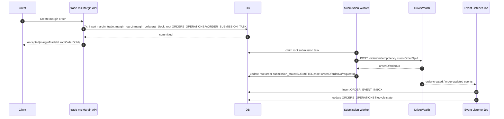

### 12.2 Main order fill to stop-loss creation happy path

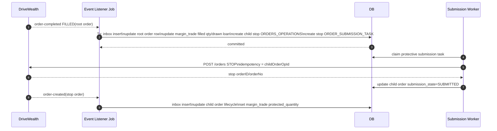

### 12.3 Main order fill, stop-loss creation fails, retry succeeds

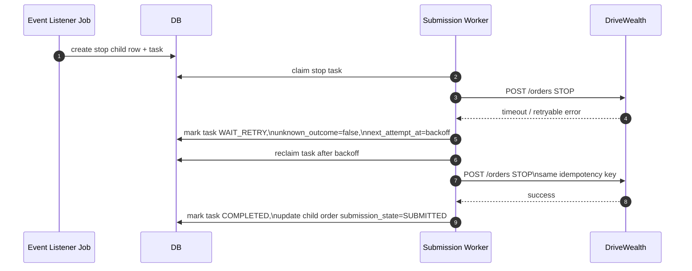

### 12.4 Duplicate fill event handling

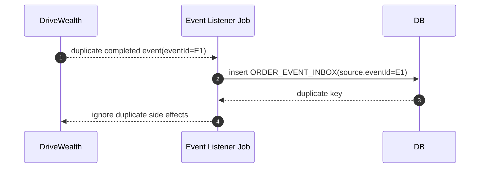

### 12.5 Unknown stop-loss creation result, reconciliation flow

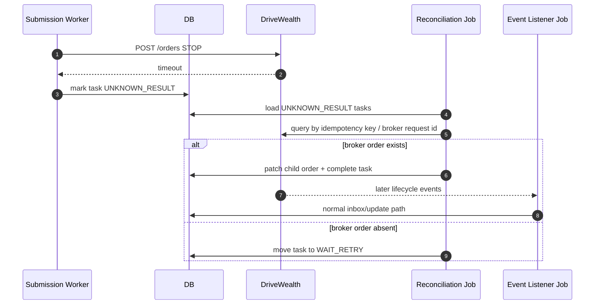

### 12.6 Service restart recovery for pending protective order creation

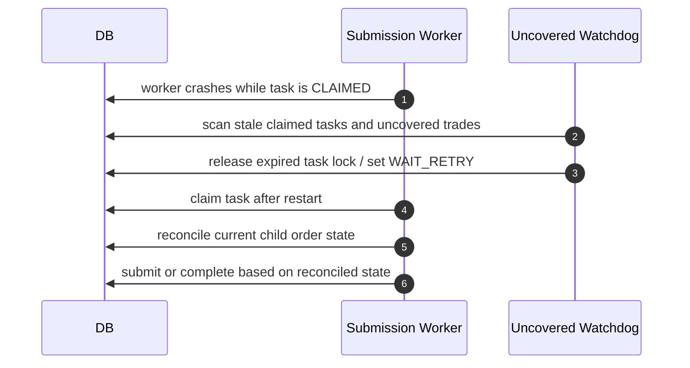

### 12.7 Borrowed/blocking accounting flow

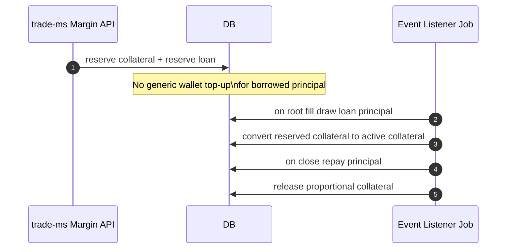

### 12.8 Position increase flow

```mermaid
sequenceDiagram
    autonumber
    participant Client
    participant TradeMS as trade-ms Margin API
    participant DB
    participant Worker as Submission Worker

    Client->>TradeMS: Increase leveraged position
    TradeMS->>DB: create new margin_trade tranche,\nnew loan, new collateral block,\nnew root order row, new task
    Worker->>DB: submit new root order
    Note over DB: Existing tranche remains unchanged;\naggregation is view-level only
```

## 13. Flowcharts / State Diagrams

### 13.1 End-to-end margin business flow

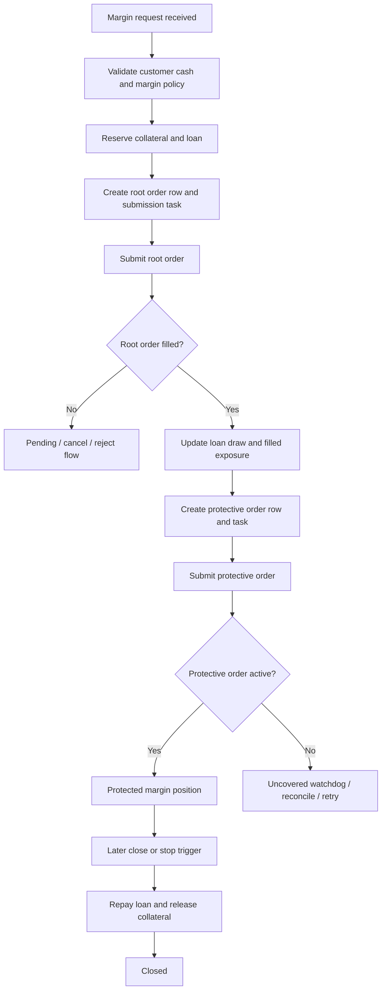

### 13.2 Protective order lifecycle

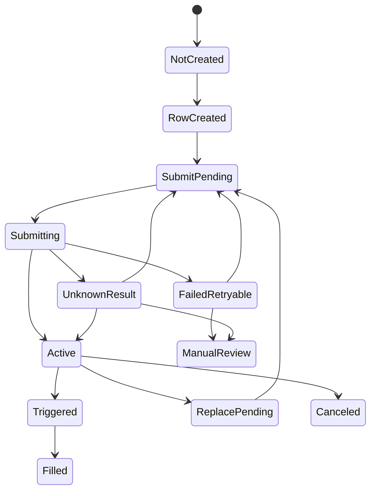

### 13.3 Retry lifecycle

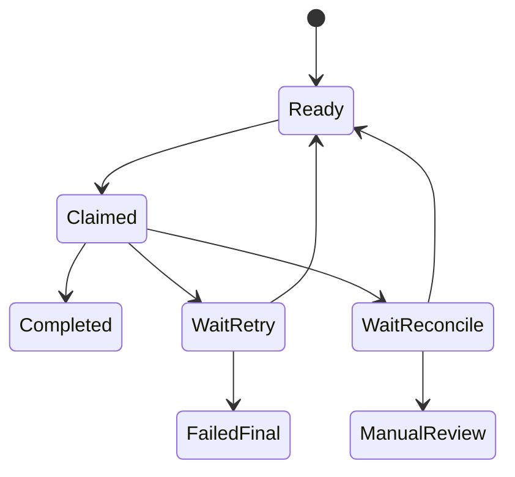

### 13.4 Accounting / blocking lifecycle

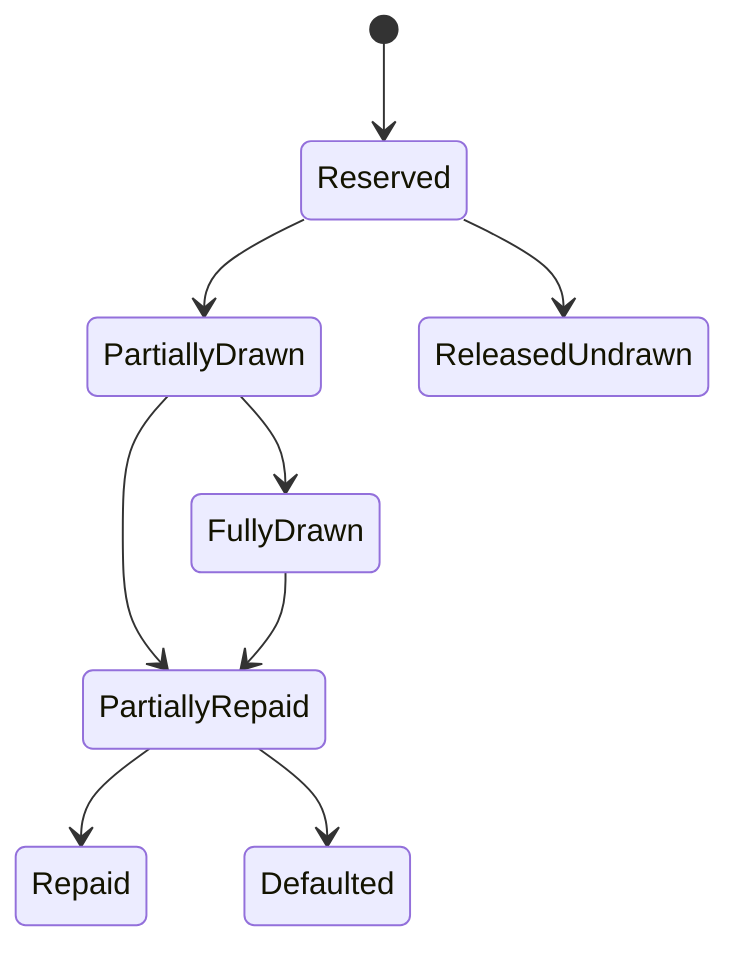

### 13.5 Reconciliation lifecycle

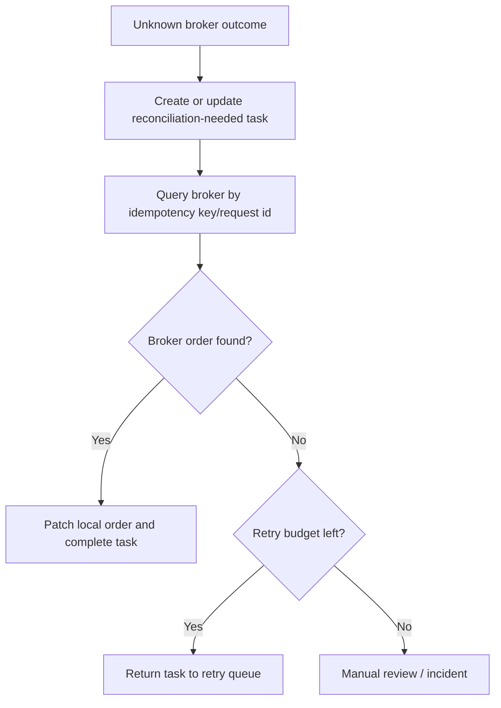

## 14. Position Increase / Future Extension Design

### 14.1 Alternatives

#### Alternative A: keep each increase as a separate tranche/order/loan

Pros:

- best auditability,
- easiest interest calculation,
- easiest collateral and repayment tracking,
- aligns with current order-centric reporting and later realized P/L lot logic.

Cons:

- more rows,
- potentially more protective orders at the broker.

#### Alternative B: merge everything into one aggregate position

Pros:

- fewer visible business objects.

Cons:

- poor auditability,
- hard to allocate interest and repayments,
- hard to unwind partial closes,
- more dangerous when different entries have different leverage or stop policies.

#### Alternative C: hybrid internal tranches with aggregate external view

Pros:

- preserves internal accounting precision,
- allows future UI simplification.

Cons:

- requires an aggregation layer,
- more complexity if one aggregate external stop must cover multiple internal tranches.

### 14.2 Recommendation

Recommendation:

Use **separate internal tranches** in v1.

That means:

- every new leveraged increase creates a new `margin_trade`,
- every tranche has its own root order row,
- every tranche has its own loan and collateral block,
- every tranche has its own protective stop-loss,
- account-level position aggregation is a read-model concern only.

Why this fits the current codebase:

- current data model is already order-centric;
- current realized P/L logic is lot/tranche-like, not aggregate-position-like;
- current code has no robust aggregate-position mutation engine for protection replacement.

## 15. Implementation Plan

### 15.1 Phase 1: minimum safe architecture

Deliverables:

- new dedicated margin API in `abb-investment-usm-trade-ms`
- `MARGIN_TRADE`, `MARGIN_LOAN`, `MARGIN_COLLATERAL_BLOCK`, `ORDER_SUBMISSION_TASK`, `ORDER_EVENT_INBOX`
- `ORDERS_OPERATIONS` correlation fields
- durable root-order submission task worker
- listener logic to create protective child order row + task on root fill
- uncovered-position watchdog
- broker reconciliation for unknown submission results
- v1 product restrictions:
  - long BUY only
  - market orders only
  - core session only
  - one stop-loss per tranche

Dependencies:

- schema migrations in `abb-investment-usm-trade-ms`
- wider platform agreement that withdrawals and other order checks will honor local collateral blocks
- broker contract validation for stop-order request shape

Risks:

- broker may require true margin-account support rather than internal buying power only
- hidden schema drift between entity mappings and deployed DB

Test strategy:

- task-worker integration tests
- duplicate-event tests
- unknown-outcome reconciliation tests
- uncovered watchdog tests
- balance/blocking tests

### 15.2 Phase 2: hardening

Deliverables:

- stop-loss quantity/price verifier
- loan/collateral consistency checker
- full broker drift reconciliation job
- manual review dashboard and alerting
- DLT / operator tooling
- better versioned replace logic for protective orders

Dependencies:

- stable phase 1 schema and task model

Risks:

- operational complexity if reconciliation volume is high

Test strategy:

- chaos/crash-recovery tests
- stale-lock tests
- semantically duplicated event tests
- reconciliation replay tests

### 15.3 Phase 3: advanced extensions

Deliverables:

- limit-order margin entry support
- position-increase aggregation views
- tranche-aware partial close engine
- interest accrual automation
- margin-call / liquidation tooling

Dependencies:

- phase 1 and 2 operational stability

Risks:

- protection replacement complexity,
- higher broker-order-management complexity

Test strategy:

- tranche merge/split tests
- price-gap and liquidation scenario tests
- long-running interest accrual tests

## 16. Testing Strategy

Recommendation:

### 16.1 Unit tests

- margin eligibility calculations
- collateral reservation/release logic
- loan draw and repayment transitions
- protection-state transitions
- task backoff and retry calculations

### 16.2 Integration tests

- margin API creates all rows atomically
- worker submits broker orders using deterministic idempotency key
- listener updates `margin_trade`, `margin_loan`, child order rows from fill events

### 16.3 Duplicate-event tests

- same event ID processed twice
- different event IDs with same payload
- completed event after already completed state

### 16.4 Crash-recovery tests

- crash after broker submit but before local task completion
- crash after root fill update but before protective task commit
- stale claimed task recovery

### 16.5 Idempotency tests

- same margin request retried by client
- same submission task retried after timeout
- same protective task retried after unknown outcome

### 16.6 Retry tests

- retryable broker 5xx
- network timeout
- reconciliation from `UNKNOWN_RESULT`

### 16.7 Partial-fill tests

- first partial fill creates uncovered state
- stop-loss task covers first fill
- additional fill requires replace or is rejected by v1 policy

### 16.8 Reconciliation tests

- external stop order exists but local row missing broker IDs
- local stop order active but external stop canceled

### 16.9 Balance/blocking tests

- blocked collateral excluded from new spot order eligibility
- blocked collateral excluded from withdrawable amount
- loan never appears as free cash

### 16.10 Invariant/property-style tests

Critical invariants:

- `protected_quantity <= filled_quantity`
- `outstanding_principal <= drawn_principal`
- `active_collateral > 0` whenever `outstanding_principal > 0`
- `manual_review_required = 1` if state is unrecoverable
- no more than one active protective order per tranche

## 17. Operational Monitoring and Alerts

Recommendation:

### 17.1 Logs

Log with stable correlation keys on every critical path:

- `marginTradeId`
- `rootOrderOperationId`
- `childOrderOperationId`
- `brokerOrderId`
- `taskId`
- `eventId`

### 17.2 Metrics

Required metrics:

- `margin_uncovered_trade_count`
- `margin_uncovered_trade_age_seconds_max`
- `margin_protective_submission_retry_backlog`
- `margin_protective_submission_unknown_result_count`
- `margin_duplicate_event_count`
- `margin_orphan_child_order_count`
- `margin_loan_collateral_mismatch_count`
- `margin_reconciliation_drift_count`
- `margin_orders_stuck_submission_pending_count`

### 17.3 Alerts

Required alerts:

- any uncovered margin trade older than SLA
- any protective submission task in `UNKNOWN_RESULT` older than SLA
- retry backlog above threshold
- duplicate protective-order detection
- loan/collateral mismatch
- reconciliation drift on active protective orders
- root or child order stuck in `SUBMIT_PENDING` / `SUBMITTING`

### 17.4 Dashboards

Required dashboards:

- active margin trades by state
- uncovered trades by age
- protection task backlog
- unknown broker outcomes
- manual review queue
- loan outstanding vs protected exposure

## 18. Final Recommendation

Recommendation:

Choose this architecture:

1. Dedicated margin domain in `abb-investment-usm-trade-ms`:
   - `margin_trade`
   - `margin_loan`
   - `margin_collateral_block`
   - `order_submission_task`
2. Extended `ORDERS_OPERATIONS` as the per-order audit and broker-correlated row.
3. `ORDER_EVENT_INBOX` in `abb-investment-usm-trade-event-listener-job` for strict event dedupe.
4. Asynchronous submission worker for both root and protective orders, using the pre-created local order UUID as the broker idempotency key.
5. Listener-driven fill processing that updates exposure, draws the loan, and creates durable protection work, but does not place the stop-loss inline from the Kafka consumer.

Anti-patterns to avoid:

- Do not top up borrowed principal into the normal customer wallet using the current generic deposit endpoint.
- Do not treat borrowed principal as `cashAvailableForTrade`.
- Do not rely on `ORDERS_OPERATIONS_HISTORY` as the only event idempotency mechanism.
- Do not correlate a margin business flow only by external broker `orderId`.
- Do not create protective orders inline inside the fill consumer without a durable task and unknown-outcome reconciliation path.
- Do not ship margin v1 with long-lived partial-fill handling unresolved.

Minimal safe v1 model:

- long BUY margin entry only,
- market orders only,
- explicit collateral block,
- explicit loan record,
- durable root submission task,
- durable protective submission task,
- event inbox,
- uncovered watchdog,
- reconciliation for unknown outcomes,
- full business-flow correlation by `margin_trade.id`.

What absolutely must not be implemented naively:

- borrowed-funds wallet top-up without a blocked-loan ledger,
- stop-loss creation as a best-effort side effect with no retry state,
- duplicate-event handling based only on logs or non-unique history records,
- any model where a filled leveraged position can remain silently uncovered after a crash or restart.
